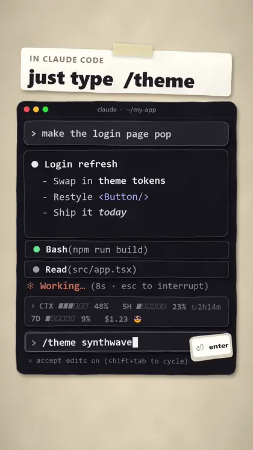
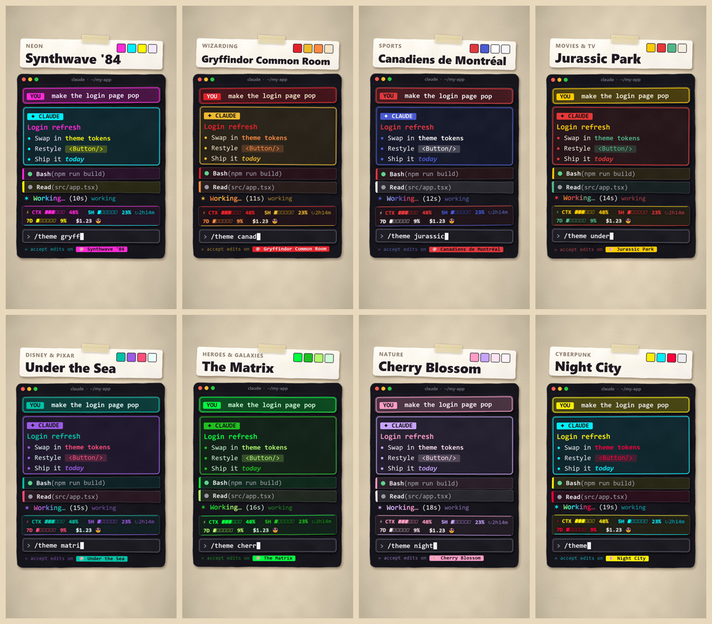
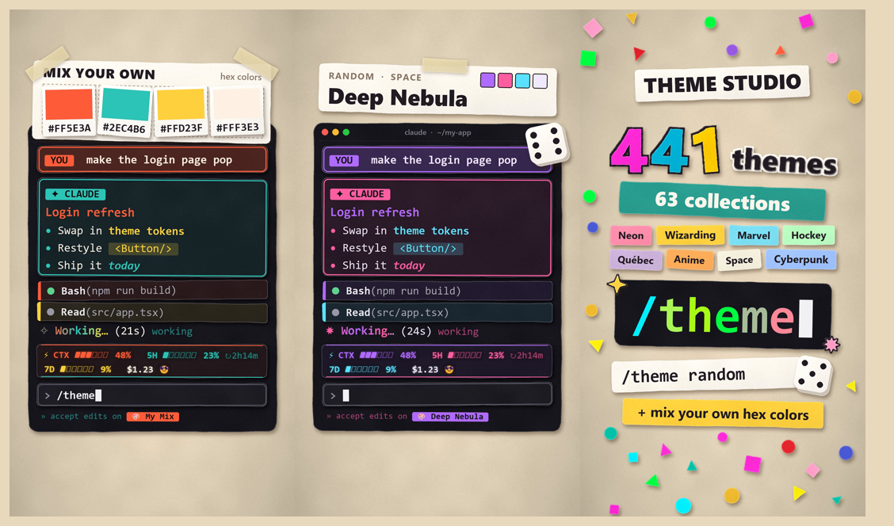

# Theme Studio for Claude Code

Recolor Claude Code's chat with one command. **441 themes in 63 collections**, from
Synthwave and Dracula to Hogwarts houses, hockey teams and Québec, or mix your own.
Every theme is contrast-checked, so it stays readable on dark and light canvases.

Comes with **Neon Usage**, a one-line band above the prompt that shows how full
your context is, your rate-limit windows and what the session has cost, in your
theme's colors.

<p align="center">
  
  <br>
  <sub>Stylized demo · <a href="https://github.com/allianceoptima/claude-theme-studio/raw/main/docs/demo.mp4">download the full 26-second video (MP4)</a></sub>
</p>

```
/theme dracula              apply a theme by name
/theme random hockey        surprise me (optionally from one collection)
/theme                      open the studio: browse, search, mix your own
```

## What it colors

| Where | What changes |
| --- | --- |
| Your prompts | Tinted bubble, accent border, a **YOU** chip, text in the theme's color |
| Claude's replies | Tinted card with a **✦ CLAUDE** chip; headings, lists, quotes, **bold**, *italic*, `inline code` and ~~strike~~ in theme colors |
| Tool rows | A colored stripe and strip on `Bash(…)`, `Read(…)` and friends: accent when done, highlight while running, red on error |
| Folded tool runs, tool results | Matching stripes, so a call and its output read as one |
| The spinner | A twinkling spark ✦ and the word shimmering letter by letter through the palette |
| The footer | Mode labels in the theme's quiet color and a 🎨 chip with the theme's name; click it to open the studio |
| End-of-turn line | `✦ Baked for 12s` in theme colors (terminal) |
| Slash-command output | A tinted strip, so `/theme`, `/cost` and friends stand out |
| Mod panes | Every pane a plugin opens gets the theme's backdrop |

### Gallery

Eight of the 441 themes on the same conversation:



Mix your own from hex codes, roll a random one, or browse 63 collections:



<sub>The gallery is drawn in a cut-paper style from the plugin's real palettes and
layout; in Claude Code it renders in your terminal's or the desktop app's own type.</sub>

What it doesn't change: Claude Code's own window chrome (the sidebar, the prompt
box, the app background). Plugins can't reach those, so no theme can either.
Code blocks keep their syntax highlighting; tables and lines with links are drawn
by Claude Code itself so links stay clickable.

## Install

Requires a Claude Code release with plugin function hooks (2.1.286 or later),
in the terminal or the desktop app's Code tab.

```
/plugin marketplace add allianceoptima/claude-theme-studio
/plugin install theme-studio@claude-theme-studio
/plugin install neon-usage@claude-theme-studio
```

Start a new session (or restart the desktop app) and type `/theme`.

## Commands

| Command | Does |
| --- | --- |
| `/theme` | Open Theme Studio: search, browse collections, mix your own, toggle options. Clicking the 🎨 chip in the footer does the same |
| `/theme <name>` | Apply a theme. Matching ignores case and accents and takes prefixes: `/theme jurassic`, `/theme montreal` |
| `/theme random [collection]` | A random theme, optionally from one collection: `/theme random zodiac` |
| `/theme next` · `/theme prev` | Step through the current theme's collection |
| `/theme list [collection]` | Every theme, or one collection's |
| `/theme bg <#hex \| auto>` | One background for every theme; text is re-checked for contrast against it |
| `/theme base <auto \| dark \| light>` | Tune colors for a dark or light canvas; `auto` follows Claude Code's theme setting |
| `/theme off` | Back to Claude Code's own look |
| `/theme help` | This list |
| `/neon-usage [on \| off]` | Show or hide the usage band |

Your theme, saved mixes and options are remembered across sessions.

## Mix your own

In the studio, click a slot's chip (**Accent**, **Secondary**, **Highlight**,
**Text** or **Background**), then click or drag in the color field (saturation
across, brightness down) or the hue strip below it. The mixer follows live while
you drag and saves when you let go. Prefer exact values? Type a hex code
(`#ff2bd6` or `f0f`) in the slot's box instead.

Press **Apply custom**, then name it under **Save as** to keep it in *My themes*.
**🎲 Random theme** applies any of the 441 presets; **🎨 Random mix** rolls a fresh
palette in one of six styles: neon, pastel, jewel, earthy, analogous or mono.

| Slot | Used for |
| --- | --- |
| Accent | Borders, headings, chips, the first gradient stop |
| Secondary | Reply cards, bullets, the second gradient stop |
| Highlight | Bold text, inline code, running tools, the hottest gradient stop |
| Text | Body text |
| Background | Message backgrounds (otherwise tinted from the accent) |

## Options

In the studio's **Look** section:

- **Messages: full color / outline only / off.** *Outline only* keeps Claude Code's
  own message rendering and adds just the colored border.
- **Tools, spinner & panes: on / off.** Theme only the messages, or everything.
- **Canvas: auto / dark / light.** See `/theme base`.
- **Background for every theme.** Same as `/theme bg`.

Animations follow Claude Code's `prefersReducedMotion` setting.

## Readability

Each theme is resolved against its canvas before anything is drawn. Body text is
held to WCAG AA (4.5:1) against its background and headings, chips and stripes to
3:1. A color that falls short is nudged toward black or white just far enough,
keeping as much of its hue as possible. The test suite checks every preset on both
canvases.

## Privacy

Both plugins run entirely inside Claude Code's plugin sandbox. They make no network
requests, read no files and send nothing anywhere. Neon Usage reads the same
figures as Claude Code's status line (`/cost`, context and rate limits).

## Development

```
git clone https://github.com/allianceoptima/claude-theme-studio
cd claude-theme-studio
npm install
claude --plugin-dir ./theme-studio --plugin-dir ./neon-usage   # try it; edits hot-reload
```

| Script | Does |
| --- | --- |
| `npm run typecheck` | `tsc` over both plugins and their tests (run `/plugin-types .claude/types` in Claude Code once first) |
| `npm run validate` | `claude plugin validate` on the marketplace and both plugins |
| `npm test` | `claude plugin test`: unit tests plus engine tests that draw on terminal and desktop |
| `npm run check` | All of the above, plus a check that the shared color module is in sync |

Layout:

```
.claude-plugin/marketplace.json   the marketplace both plugins install from
theme-studio/
  hooks/register.tsx              engine hooks: commands, drawing, the studio pane
  hooks/presets.ts                the 441 palettes
  hooks/palette.ts                lookup, search, validation, random picks
  hooks/look.ts                   a palette resolved against a canvas, contrast-checked
  hooks/color.ts                  hex, mixing, gradients, WCAG contrast
  hooks/markdown.tsx              the reply painter
  types/index.d.ts                state contract
  tests/                          unit and engine tests
neon-usage/
  hooks/register.tsx              the band
  hooks/format.ts                 meters, countdowns, money
  hooks/color.ts                  copy of theme-studio's (npm run sync:color)
```

See [CONTRIBUTING.md](CONTRIBUTING.md) to add a theme or a collection.

## Trademarks

Theme names describe the palettes they evoke. They are not affiliated with,
sponsored by or endorsed by the owners of any franchise, team, brand or place
named, and every trademark belongs to its owner. The themes carry colors only:
no logos, artwork or other marks.

## License

[MIT](LICENSE)
